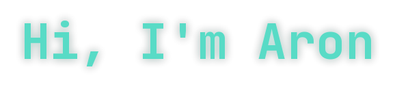

I'm a **Software Developer** and **Computer Science student** working across **AI systems**, **Android development**, and **full-stack web**. Currently building at **Ketha Technologies**, with a recurring focus on verification, record-keeping, and trust systems for institutions and underserved markets across Kenya and East Africa.

---

## Tech Stack

**Languages**

**Frontend**

**Backend & Data**

**AI / Cloud**

**Tools**

---

---

Thanks for stopping by — if you're working on something in AI, Android, or civic/institutional tech in East Africa, I'd love to hear about it.

